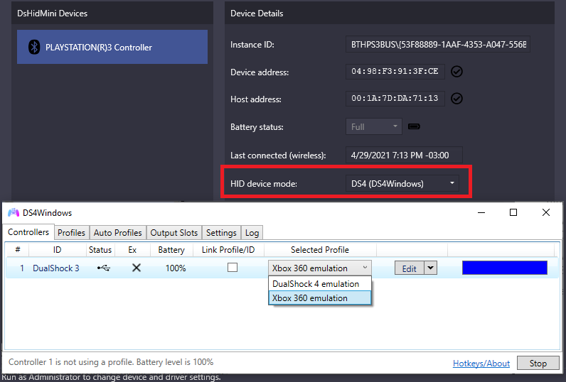
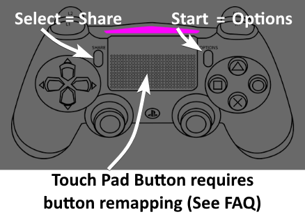
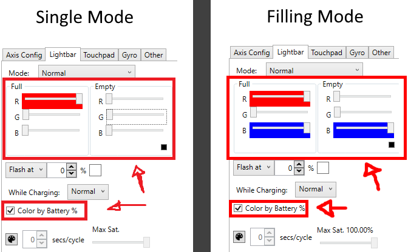

# DS4Windows Mode User Guide

## General info

!!! important "Jays2Kings' DS4Windows __IS NOT SUPPORTED__!"
    If you just search "DS4Windows" on Google/Bing/whatever the first result will probably be the obsolete Jays2Kings' version

In `DS4Windows` HID Device Mode, the controller appears as a custom device that can only be detected by [Ryochan7's DS4Windows](https://github.com/Ryochan7/DS4Windows), allowing the user to then emulate a DualShock 4 or Xbox 360 (__XInput__) controller as well as make use of most of its features.

=== "What works"

    - Xbox 360 (__XInput__) / DualShock 4 emulation according to the selected profile settings in DS4Windows
    - Rumble works as normal
    - DS4's Touchpad Button can be used by remapping a button to it (e.g.: use Select as the _TP button_ instead of _Share_)
    - DS3's LEDs can be controlled by setting the correct Light Bar colors (more on that on a later section)
    - DS4Windows's `Flash Lightbar at High Latency` function makes the LEDs flash accordingly
    - Basically every other DS4Windows function that is not related to the Light Bar or motion works as intended

=== "What does NOT work"

    - DS3 controllers are always recognized as if they were connected by USB. As such, DS4Windows Bluetooth functions like auto-disconnect on idle and disconnect on button combo are not supported. This is a limitation on DsHidMini side and can't be fixed by DS4Windows. [The built-in equivalent functions of DsHidMini](https://github.com/ViGEm/DsHidMini#features) should be used instead
    - Motion/UDP server is not supported and will remain so until someone manages to translate the motion info from the DS3 to the DS4 motion standard
    - Settings that make the Light Bar color flash, pulse or change randomly (rainbow mode) are not supported
    - Specific DS4 touchpad movements are not supported, only the Touchpad Button (another button needs to be remapped to it)

-------------

## Using the controller with DS4Windows

- To start, [the controller must be in `DS4Windows` mode](../HID-Device-Modes-Explained)
- Download the latest [Ryochan7's DS4Windows](https://github.com/Ryochan7/DS4Windows/releases) release package according to your [system architecture](https://www.howtogeek.com/howto/21726/how-do-i-know-if-im-running-32-bit-or-64-bit-windows-answers/)
- Extract the package to an easily accessible folder
- Run DS4Windows.exe
- Install the ViGEmBus Driver if asked to

After that, the controller should be properly recognized by DS4Windows. If it's not, verify again if it is in "[DS4Windows mode](../HID-Device-Modes-Explained)".

{: .glightbox }

### Important remarks

From here, DS4Windows can be used _mostly_ as usual. XInput and DS4 emulation, as well other functions, can then be set-up in the profiles settings according to the user needs. Besides that:

- Keep in mind: `Select` and `Start` buttons are recognized as the `Share` and `Options` buttons in DS4Windows  
{: .glightbox }
- In case you need, there are more detailed instructions on how to change to DS4 emulation in [the FAQ](#frequently-asked-questions)
- If you want your controller's LEDs to represent the current battery level, check the **Simple Led Control -> Example 2** in the [Light Bar color to LEDs translation SECTION](#light-bar-color-to-leds-translation)
    - Read the full Light Bar translation section if you want to check all possible types of LED control that are possible via DS4Windows settings  
- It's recommended you have a quick look at the [_Frequently Asked Questions_](#frequently-asked-questions) section, read at least the title of the topics

## Light Bar color to LEDs translation

!!! note "Optional section"
    Read this section if you want to control your controller's LEDs to show the current battery or selected profile

By setting the correct Light Bar color values in the profile settings it is possible to control the LEDs on the DS3, which can be useful to:

- Make the controller's LEDs represent the current battery level 
- Represent the current selected profile as a specific LED
- Indicate the battery level by using _Special Actions_ in the profile's settings

Beware that functions in DS4Windows that make the Light Bar flash, pulse or randomize the colors (`rainbow mode`) are not supported and can make the LEDs change to an undesired state, though the `Flash Light Bar at High Latency` function do is supported and will make the LEDs flash at a high frequency.

There are 2 modes of Light Bar to LED control: **Simple** and **Complete**. To learn how to use them and see easy to follow examples expand the following item:

??? info "Modes of Light Bar Translation (click to expand)"

    === "Simple LED control"

        - Simple to set-up
            - Check the examples in the end of this section!
        - Good to represent which profile is active (see example 1)
        - Necessary when making DS4Windows show the controller's battery level and for battery related `Special Actions` (see examples 2 and 3 respectively)

        {: .glightbox }

        __FORMS OF ACTIVATION:__

        | Simple LED control mode | How to activate | Description |
        | :---: | :---: | :---: |
        | __Single mode__ | Green and Blue = 0 | Only the chosen LED is ON |
        | __Filling Mode__ | Green = 0, Blue = 255 | The chosen LED and the ones before it are ON |

        When this form of translation is active, the `Red color value` will be translated to the LEDs state according to the following table:

        | RED value (Dec) | LED state |
        | :---: | :---: |
        | 0 - 64 | Blinking LED 1 |
        | 65 - 94 | LED 1 |
        | 95 - 148 | LED 2 |
        | 149 - 201 | LED 3 |  
        | 202 - 255 | LED 4 |

        ??? example "Example 1: Setting up a profile to be represented as LED 3 only (__single mode__)"

            {: .glightbox }

        ??? example "Example 2: Setting up a profile to reflect the controller's battery level"

            {: .glightbox }

        ??? example "Example 3: Setting up a _Special Action_ to make the LEDs reflect the controller's battery level"

            {: .glightbox }

    === "Complete LED control"

        - "Harder" to set-up (not really)
        - Allows any combination of LEDs on
        - Useful if the user wants to differentiate between more than 4 profiles

        __HOW TO ACTIVATE:__ Green and Blue = 255

        When this form of translation is active, the Red color value from 0 to 15 will be translated to the LEDs state according to the following table:

        | LED 4 |  LED 3 | LED 2 | LED 1 |  RED value (Dec) |
        | :---: | :---: | :---: | :---: | :---: |
        |  |  |  |  | 0 |
        |  |  |  | ON | 1 |
        |  |  | ON |  | 2 |
        |  |  | ON | ON | 3 |
        |  | ON |  |  | 4 |
        |  | ON |  | ON | 5 |
        |  | ON | ON |  | 6 |
        |  | ON | ON | ON | 7 |
        | ON |  |  |  | 8 |
        | ON |  |  | ON | 9 |
        | ON |  | ON |  | 10 |
        | ON |  | ON | ON | 11 |
        | ON | ON |  |  | 12 |
        | ON | ON |  | ON | 13 |
        | ON | ON | ON |  | 14 |
        | ON | ON | ON | ON | 15 |

        __e.g.:__ Setting up a profile to be represented as LEDs 4 and 2.

        {: .glightbox }

## Frequently Asked Questions

??? question "_How do I change between XInput and DS4 emulation?_"

    The controller that DS4Windows emulates is dependent on the current selected profile. By default, the profile that comes with DS4Windows called... _Default_... is set to emulate a Xbox 360 controller. You can create new profiles with different settings to best fit your use case, though this section will focus solely on creating a profile with DS4 emulation:

    - Go to the _Profiles_ tab
    - Click on the "New" button to create a new profile
    - When asked if a preset is to be used, choose "yes"
    - Select `Gamepad` and then `DualShock 4` at the Output Controller
    - Adjust the Light Bar color to what you desire acordingly to the [_Light Bar to LEDs translation_ section](#light-bar-color-to-leds-translation) (in the example below the profile will be represented by LED 2)
    - Give a name to your profile (e.g.: DS3 to DS4)
    - Save the profile
    - Back in the _Controllers_ tab, click on the _Selected profile_ box and change from default to the profile you just created  
    {: .glightbox }

    And done, now you can switch between XInput/DS4 emulation by changing between profiles.

    Keep in mind that some games that support DS4 controllers use the `Touch Pad` for options/to open the map/etc. In this case, you'll need to [remap a button as the `Touch Pad` button](#select-button-is-not-recognized-in-some-games-when-emulating-a-ds4-how-do-i-use-the-touch-pad-button) on a new profile to use it.

??? question "_Do I need to use HidHide or the "hide ds4 controllers" option to hide my DS3 controller in order to prevent the "double controller" issue?_"

    No need to. The "real" part of the DS3 controller in DsHidMini's DS4Windows Mode can only be recognized by DS4Windows and is therefore already imune to the "double controller" or "double input" issue. Games will only be able to detect the DS3's emulated/virtual Xbox 360/DS4 counterpart.

??? question "_Select button is not recognized in some games when emulating a DS4 / How do I use the Touch Pad button?_"

    A DS3 controller has 13 buttons while a real DS4 controller has 14, this extra button being the `Touch Pad` button which can't be mapped directly to the DS3 by DsHidMini.

    Some games that support DS4 controllers use the `Touch Pad` for options, opening the map, etc. To work around this, the user needs to remap an existing button to the `TP` one. 

    Usually, games that use the `TP` button don't use the `Share` button (the default `Select`), so the usual bet is to remap it to the `TP`, though any other one can be chosen. So, after creating a profile with `DS4` emulation:

    - Duplicate your DS4 profile, choose a different name to it
    - Edit the new profile
    - On the left side, in the DualShock 4 picture, click on the button you want to remap
    - On the new window that appears, select the middle of the Touch Pad
    - Save your profile and switch to it

    If a game uses both the `Share` and `TP` buttons, you can have a profile with `Share` as it is and the `PS` button remapped to the `TP`. Or, if you want more advanced solutions, you can use `special actions` in the profile settings so you can switch between different profiles by button combinations mid-game.

??? question " _Steam/Some emulator or app doesn't detect my controller when emulating a DS4, only when emulating a Xbox 360_"

    Steam and some other apps/emulators (Yuzu/CEMU) will fully ignore DS4 controllers, real or virtual, if they detect that DS4Windows is running. This happens as their own means of preventing the "double controller" issue, which is not a problem for DS3 controllers being used with DS4Windows.

    To workaround this detection and make those apps stop ignoring the DS4 controller, [DS4Windows needs to be running under a custom ".exe" name](https://docs.ds4windows.app/guides/ds4w-custom-name/).

    !!! note "Some remarks regarding Steam"

        - Regarding most Steam games, 99% of the games that support DS4 controllers should detect the emulated one as normal regardless if Steam itself is not
        - If using a custom ".exe" name it's also recommended to DISABLE Steam's "**Playstation Configuration Support**", in its controller settings, so Steam doesn't remap your controller _again_ along DS4Windows
        - A custom ".exe" name must be used with DS4W for the emulated DS4 to interact with Steam's Big Picture Mode
            - But the "Playstation Configuration Support" option doesn't need to be enabled for this

??? question "_'X' game does not detect my emulated DS4 / my game is not showing PS button icons_"

    - First, double check if the game actually supports DS4 controllers _and_ has native PS icons when played with a DualShock 4. There is no direct way to check this besides just testing, Googling around and looking at forums
    - If the game does not support DualShock 4/PS icons then that's in no way related to us and we can't do anything about it
    - If you are 100% sure the game supports PS button icons/DualShock 4, then it may be detecting that DS4Windows is running and then ignoring DS4 controllers (super rare case, only 1 game is known to do it). Check the [topic above](#i-cant-control-steams-big-picture-when-using-a-emulated-ds4-steam-doesnt-detect-my-controller-when-its-emulated-as-a-ds4-only-when-emulated-as-a-xbox-360) on how to solve this
    - If the game still doesn't recognize the emulated DualShock 4 then we have no idea what's going on and you are welcome on [reaching us through the proper means](https://vigem.org/Community-Support/)

??? question "_How do I do 'X' thing on DS4Windows?_"

    DS4Windows is a really amazing tool that can do lots of things, but the purpose of this guide isn't covering DS4Windows in itself, it's to give users the minimum necessary to have XInput/DS4 emulation and to cover DsHidMini related functions, like Light Bar color to LEDs translation. Because the other things it can do are not related to DsHidMini then it's recommended that you look in [its wiki](https://github.com/Ryochan7/DS4Windows/wiki/Settings) or google around for online tutorials. 
