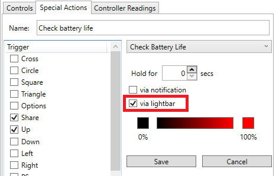
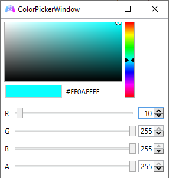

# DS4 Mode User Guide

In "DS4 (DS4Windows)" HID Device Mode, the driver emulates a DualShock 4 with an artificial Vendor & Product ID supported by [Ryochan7's DS4Windows](https://github.com/Ryochan7/DS4Windows), allowing the user to emulate a DS4 or XInput controller as well as using most of its functions.

## What does work

- XInput / DualShock 4 emulation according to the selected profile settings in DS4Windows.
- Rumble works as normal.
- DS3's LEDs can be controlled by setting the correct lightbar colors (more on that on a later section).
- Basically every other DS4Windows function that is not related to the lightbar or motion works as intended.

## What does not work

- DS3 controllers are always recognized as if they were connected by USB. As such, DS4Windows bluetooth functions like auto-disconnect on idle and disconnect on button combo are not supported. This is a limitation on DsHidMini side and can't be fixed by DS4Windows. The built-in equivalent functions of DsHidMini should be used instead.
- Motion/UDP server is not supported and will remain so until someone manages to translate the motion info from the DS3 to the DS4 motion standard.
- Settings that make the lightbar color flash, pulse or change randomly (rainbow mode) are not supported.
- DS3 touchpad not supported for obvious reasons. To use the touchpad click when emulating a DualShock 4 it needs to be set up as a macro (as for the day this guide was written, march 07, 2021, DS4Windows does not support this function).

## Verifying/Changing current DS3 HID Device Mode

Go [here](../HID-Device-Modes-Explained) on how to do so. The DS3 needs to be in "DS4 (DS4Windows)" mode to be detected by DS4Windows.

## Using the controller with DS4Windows

1. Download the latest DS4Windows release package from [here](https://github.com/Ryochan7/DS4Windows/releases) according to your Windows version (x86 for 32bits, x64 for 64bits)
2. Extract the package to an easily accessible folder
3. Run DS4Windows.exe
4. Install the ViGEmBus Driver if asked to

After that the controller should be properly recognized by DS4Windows. If it is not, go back to the previous section on how to verify/change the current DS3 mode.

From here, DS4Windows can be used as usual. XInput and DS4 emulation, as well other functions, can then be set-up in the profiles settings according to the user needs. Enjoy!

## Lightbar color to LEDs translation

By default, DsHidMini sets the LEDs on the DS3 to show the current battery level (4 = full -> 1 = low). When setting the correct lightbar color values with DS4Windows it is possible to control the LEDs on the DS3, which can be useful to represent the current selected profile or alternative ways on showing the battery level by using macros or the built-in battery level indicator.
Beware that functions in DS4Windows that make the lightbar flash, pulse or randomize the colors (rainbow mode) are not supported and can make the LEDs change to an undesired state. Because of this, the function "Flash lightbar at High Latency" does not work as intended when a DS3.

!!! important "Keep in mind"
    Unsupported color values won't change the LEDs any further until a new supported color value is set.

### Simple LED control

- Only 1 LED can be ON at a time
- Simple to set-up
- Necessary for some macros and to let DS4Windows take hold of showing the controllers battery level

To activate this form of lightbar color translation, both the values of the Green and Blue colors must be set as "0". After that, the Red color value will be translated to the LEDs state according to the following table:

| RED value (Dec) |  RED value (Hex) | LED state |
| :---: | :---: | :---: |
| 0-63 | 00-3F | LED 1 ON |
| 64-127 | 40-7F | LED 2 ON |
| 128-191 | 80-BF | LED 3 ON |
| 192-255 | C0-FF | LED 4 ON |

e.g. 1: Setting up a profile to be represented as LED 3.

{: .glightbox }

e.g. 2: Setting up a macro to make the LEDs reflect the controller's battery level.

{: .glightbox }

e.g. 3: Setting up DS4Windows to control the LEDs in order to show the controller's battery level all the time.

{: .glightbox }

### Complete LED control

- "Harder" to set-up (not really).
- Allows any combination of LEDs on.
- Useful if the user wants to differentiate between more than 4 profiles.

To activate this form of lightbar color translation, both the values of the Green and Blue colors must be set as "255". After that, the Red color value from 0 to 15 will be translated to the LEDs state according to the following table, where the value of "0" and "1" on the LEDs columns set the corresponding LED to "OFF" and "ON", respectively:

| LED 4 |  LED 3 | LED 2 | LED 1 |  RED value (Dec) |  RED value (Hex)
| :---: | :---: | :---: | :---: | :---: | :---: |
| 0 | 0 | 0 | 0 | 0 | 0 |
| 0 | 0 | 0 | 1 | 1 | 1 |
| 0 | 0 | 1 | 0 | 2 | 2 |
| 0 | 0 | 1 | 1 | 3 | 3 |
| 0 | 1 | 0 | 0 | 4 | 4 |
| 0 | 1 | 0 | 1 | 5 | 5 |
| 0 | 1 | 1 | 0 | 6 | 6 |
| 0 | 1 | 1 | 1 | 7 | 7 |
| 1 | 0 | 0 | 0 | 8 | 8 |
| 1 | 0 | 0 | 1 | 9 | 9 |
| 1 | 0 | 1 | 0 | 10 | A |
| 1 | 0 | 1 | 1 | 11 | B |
| 1 | 1 | 0 | 0 | 12 | C |
| 1 | 1 | 0 | 1 | 13 | D |
| 1 | 1 | 1 | 0 | 14 | E |
| 1 | 1 | 1 | 1 | 15 | F |

e.g. Setting up a profile to be represented as LEDs 4 and 2.

{: .glightbox }

## Solving double input issues on games

Some games can end-up detecting two controllers/inputs when using DS3 with DS4Windows. This happens because the game is picking both the real controller input and the emulated Xbox/DualShock 4 controller created by DS4Windows. As of the moment of writing (March 07, 2021) there are 2 ways on attempting to solve this issue:

### Correctly uninstalling HidGuardian (in case things go wrong)

The installer tool that will be used to install HidGuardian is also capable of correctly uninstalling it if the user chooses, just open it and hit "Uninstall", then reboot the computer.

{: .glightbox }

In case things go wrong (and they shouldn't as long as the user carefully follows the steps described in this section) or the uninstaller fails here are 2 guides on how to solve the issue:

- [If the uninstaller fails](../HidGuardian/Taming-HidGuardian-Gen1/)
- [If the user loses access to keyboard and mouse](https://github.com/x360ce/x360ce/wiki/HID-Guardian)

