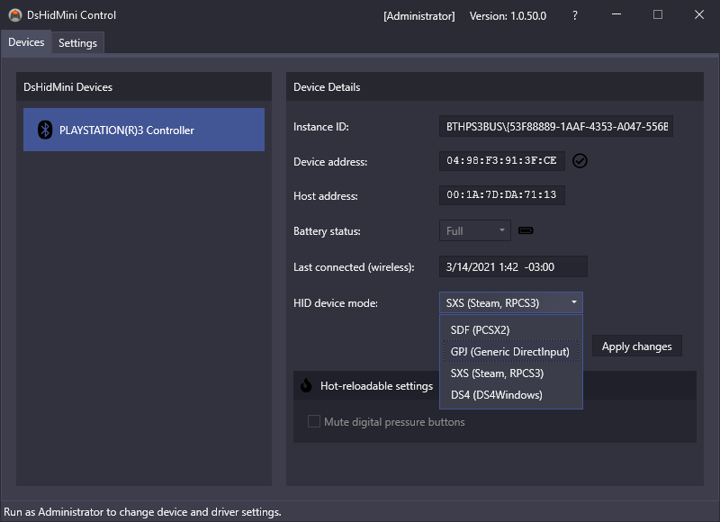

# HID Device Modes Explained

!!! hint "Important topic"
    This is one of *the* core features of the driver and understanding it is vital for great gaming experience so take your time and study thoroughly 😘

DsHidMini aims for maximum possible compatibility with existing tools or games without the need for any custom code. It supports different "HID Device emulation modes", meaning upon boot-up it can present the controller as different types of HID devices, each sporting a unique set of specialized features outlined below. The device mode you choose dictates the level of compatibility with certain 3rd party software and how the controller is "seen" by processes. Read on for details.

## How to adjust the settings

Connected controllers using DsHidMini can be adjusted in the DsHidMini Control UI tool (`DSHMC.exe`) that is downloaded along the driver. It needs to be run as Administrator to allow changing the current HID Device Mode. After every change, press the "Apply changes" button to make them effective, which will cause the affected controller to disconnect on Bluetooth and restart on USB. For Bluetooth it needs to be powered on again manually afterwards by pressing the "PS" button.

{: .glightbox }

The HID Device Mode is a per device, per connection type setting, meaning that:

- Each connected controller can be set to a different mode
- The same controller can be in different modes when wired or wireless, so always check which mode the device is set to when transitioning from wired to wireless and vice versa

## HID Device Modes

The games and tools outlined here are **recommendations**, please feel free to experiment to your heart's content ❤️

### SDF

!!! important "TL;DR:"
    Use this mode for best compatibility with the [PCSX2 PlayStation 2 Emulator](https://pcsx2.net/).

**Single Device** with **Force Feedback** mode. In this mode, the controller is presented as one "almost"-DirectInput-compatible HID device with **pressure sensitive** features exposed as additional sliders. The rumble motors can be controlled via **Force Feedback effects** (Constant Force Effect). The advantage of this mode is a 100% compatibility with all unmodified versions of PCSX2 with the LilyPad gamepad plugin (shipped by default).

The downside of this mode is, that the pressure axes exceed the limit of supported axes per device and therefore pressure sensitive axes will not be available in games using DirectInput. They will however work fine with any engine using the low level HID API instead.

The default LED behavior in this mode is the charging animation and can't be altered.

### GPJ

!!! important "TL;DR:"
    Use this mode with [x360ce](https://www.x360ce.com/) or to experiment with older games.

**Gamepad plus Joystick** mode. In this mode, the controller is presented as **two separate HID devices**; a traditional gamepad featuring the same set of features like a common Xbox 360 controller and a Joystick, only handling the pressure axes. This mode guarantees the best potential compatibility with legacy solutions purely relying on DirectInput and works around the mentioned axis limit. The rumble motors can be controlled via **Force Feedback effects** (Constant Force Effect).

The default LED behavior in this mode is the charging animation and can't be altered.

### SXS

!!! important "TL;DR:"
    Use this mode with [Steam](https://store.steampowered.com/) or the [RPCS3 PlayStation 3 Emulator](https://rpcs3.net/).

**SIXAXIS.SYS** mode. In this mode, the driver emulates the behavior of the official Sony `sixaxis.sys` driver shipped with the PS Now application. Use this mode to ensure compatibility with [Steam](https://store.steampowered.com/), the [PS Now](https://www.playstation.com/en-us/ps-now/) application or the [RPCS3 PlayStation 3 Emulator](https://rpcs3.net/).

The default LED behavior in this mode is the charging animation. If a compatible application sends output reports to the device, the driver will "hand over" control to the application and stops the charging indicator until the device has been restarted.

### DS4Windows

!!! important "TL;DR:"
    Use this mode with [Ryochan7's DS4Windows](https://github.com/Ryochan7/DS4Windows/). Follow [these instructions](../DS4-Mode-User-Guide) to set it up properly.

**DualShock 4** mode. In this mode, the driver emulates a DualShock 4 with an artificial Vendor & Product ID supported by the "Ryochan7 Edition" of [DS4Windows](https://github.com/Ryochan7/DS4Windows/). You can use almost all features DS4Windows offers with a DualShock 3 (excluding nonexistent features like the track pad or the light bar) including **XInput emulation**.

The default LED behavior in this mode is the charging animation. Once the controller is picked up by DS4Windows, light bar changes will get translated to LED states ([see this article for details](../DS4-Mode-User-Guide)) and rumble requests passed through.

**Motion controls** are currently **not supported** (no gyroscope or accelerometer) and therefore **will not work with [CEMU](https://cemu.info/)** when the UDP Server is active.

### XInput

!!! important "TL;DR:"
    Use this mode with [RetroArch](https://www.retroarch.com/), [Steam](https://store.steampowered.com/) or any game with Xbox Controller support.

**Xbox One Controller** mode. This is the driver default when shipped. In this mode, the controller is emulating an Xbox One Controller. This mode guarantees the best potential compatibility with pretty much all modern PC games with Xbox (360/One)Controller support either standalone or shipped through Steam.

The default LED behavior in this mode is the charging animation and can't be altered. The lit LED *does not* represent the player index.
