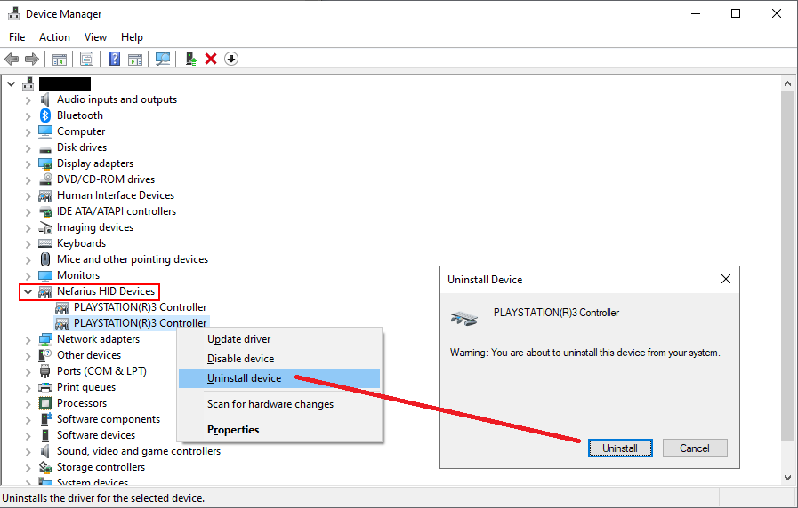
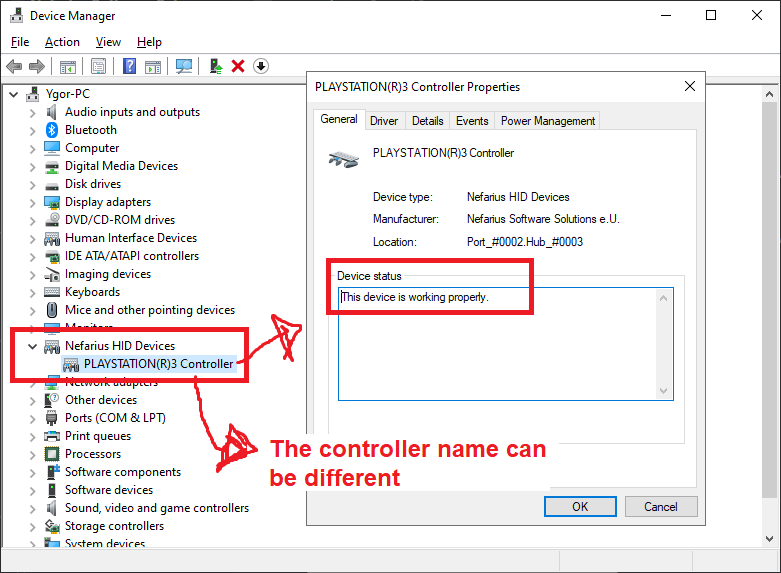

# How to Install/Remove

DsHidMini can only work its magic if it's the dominant driver for your controller, you may have others preinstalled that need removal, this guide covers most of the known cases.

## Installation

No matter what software you may have preinstalled, this step is always the same 😀

- **If you want Bluetooth support** you need to [install BthPS3 first](https://github.com/ViGEm/BthPS3/releases) (optional for USB)
- [Go to the latest release on GitHub](https://github.com/ViGEm/DsHidMini/releases/latest)
- Download the attached `dshidmini_vX.X.X.X.zip` archive to an arbitrary location on your machine
- Extract the archive (doesn't matter where to, e.g. your Downloads folder)
- [Make sure you know your architecture](https://vigem.org/research/How-to-check-architecture/)
    - On x64 navigate to `x64\dshidmini`
    - On x86 navigate to `x86\dshidmini`
- Right-click on `dshidmini.inf` and select Install
    
    - If you've never installed great software before 😉 this might show up (hit Install):  
    
    - Should only take a moment until success dialog
    
- With your controller connected by USB, open the DsHidMini Control Utility (It's the `DSHMC.exe` file that comes along the driver archive) to see if the controller gets detected
    - Run it as Administrator to change settings, [check the documentation for details](../HID-Device-Modes-Explained)
    - It is not required to keep the utility running for the driver to function, only if you want to observe battery level or change settings

By now if you plug in your controller (or reboot the machine) chances are high that everything already works as expected. If it doesn't, worry not, [read on here](#troubleshooting)!

## Beta builds

[You can get the latest automatic build of the DsHidMini control utility here](https://ci.appveyor.com/api/projects/nefarius/dshidmini/artifacts/bin/DSHMC.exe?job=Platform%3A%20x64) which can contain newer yet unfinished features. May contain bugs 🐛 use with care 😊 It's unsigned so you'll get a warning when launched as Administrator, this is expected. Happy testing!

## Updating

New releases are expected to appear quite frequently during Beta Testing, so make sure to regularly come back and check the GitHub releases page. If you want to update, simply [follow all the same steps of the installation](#installation) and overwrite any existing files. Reboot your machine to be extra safe if it didn't work right away.

## Removal

If you want to remove DsHidMini from your computer you first need to delete it from Windows Driver Store:

- Use [Driver Store Explorer](https://github.com/lostindark/DriverStoreExplorer/releases) to remove the `dshidmini.inf` driver:  
{: .glightbox }  
The driver will still be loaded for controllers that were using it, so be sure to uninstall them from Device Manager  
- Plug in your controllers
- Open Device Manager by pressing ++win+x++ and select it from the menu:  
{: .glightbox }  
- Expand `Nefarius HID Devices`
- For each device under `Nefarius HID Devices`, right click it and select `Uninstall Device`, then select `Uninstall` on the appearing confirmation window  
{: .glightbox }  

After that, DsHidMini should be fully gone from your computer 😥

## Troubleshooting

### Verifying if the controller is loading the correct driver

The driver can't do anything if it is not being used, so to check this:

- Connect your controller __by USB__ 
- Open Device Manager by pressing ++win+x++ and select it from the menu
- Look around and expand `Nefarius HID Devices`, your controller should appear there. Double click on it to check the driver status:
{: .glightbox } 

If the device appears there but the driver status indicates some error (e.g. `This device cannot start (Error Code 10)`) try pressing the `Reset` button on the back of your controller and then reconnecting it. Rebooting your computer is also worth a shot.

If the controller does not appear under `Nefarius HID Devices`/if this section doesn't exist, you probably have another driver taking priority over DsHidMini. To solve this you need to remove those rogue drivers. See how to do so on the [_removing conflicting drivers_](#Removing-conflicting-drivers) section.

### Removing conflicting drivers

We need to first determine if any other conflicting device driver is present on the system and remove it so DsHidMini can take over that job. The steps outlined here may or may not be applicable to your system, it entirely depends on your past 😜 and the stuff you potentially installed. Worry not though, together we shall succeed ✨

#### ScpToolkit

If you had ScpToolkit installed, you need to purge every remains from your machine. [Follow this comprehensive removal guide](https://vigem.org/projects/ScpToolkit/ScpToolkit-Removal-Guide/).

#### Official Sony driver

If you have/had PS Now installed, chances are high you have the official Sony `sixaxis.sys` on your system. [Follow this procedure to remove it](../SIXAXIS.SYS-to-DsHidMini-Guide).

#### FireShock

If you've used [Shibari](https://github.com/ViGEm/Shibari) before you probably have FireShock installed, lets rectify that:

- Use [Driver Store Explorer](https://github.com/lostindark/DriverStoreExplorer/releases) to remove the `fireshock.inf` driver:  
{: .glightbox }  

Done 🎉
