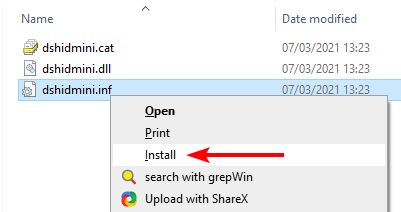
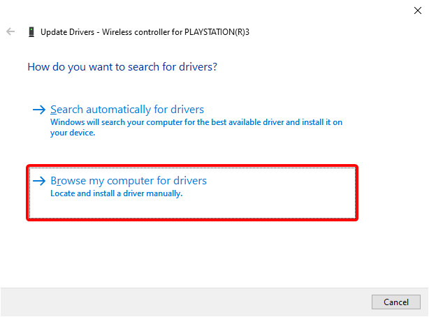
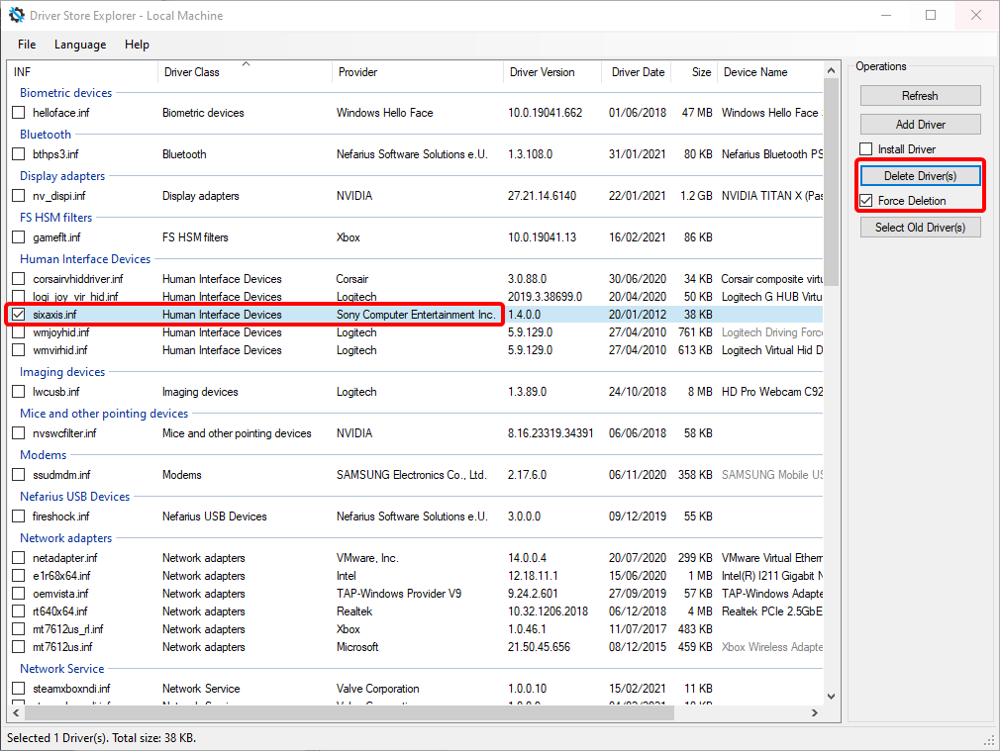
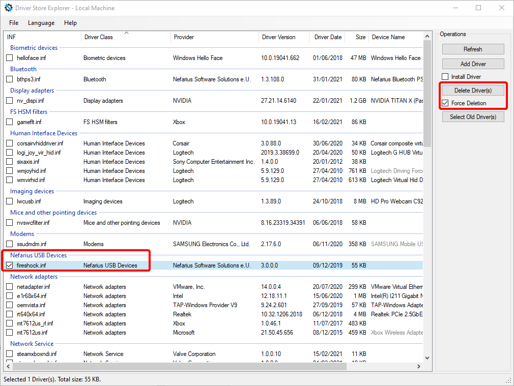

# How to Install

!!! important "Work in progress"

DsHidMini can only work its magic if it's the dominant driver for your controller, you may have others preinstalled that need removal, this guide covers most of the known cases.

## Installation

No matter what software you may have preinstalled, this step is always the same 😀

- [Go to the latest release on GitHub](https://github.com/ViGEm/DsHidMini/releases/latest)
- Download the attached `dshidmini_vX.X.X.X.zip` archive to an arbitrary location on your machine
- Extract the archive (doesn't matter where to, e.g. your Downloads folder)
- [Make sure you know your architecture](https://vigem.org/research/How-to-check-architecture/)
    - On x64 navigate to `x64\dshidmini`
    - On x86 navigate to `x86\dshidmini`
- Right-click on `dshidmini.inf` and select Install
    
    - Should only take a moment until success dialog
    
- Run `DSHMC.exe` to see if the controller gets detected
    - Run it as Administrator to change settings, [check the documentation for details](../HID-Device-Modes-Explained)

By now if you plug in your controller (or reboot the machine) chances are high that everything already works as expected. If it doesn't, worry not, [read on here](#troubleshooting)!

## Updating

New releases are expected to appear quite frequently during Beta Testing, so make sure to regularly come back and check the GitHub releases page. If you want to update, simply [follow all the same steps of the installation](#installation) and overwrite any existing files. Reboot your machine to be extra safe if it didn't work right away.

## Troubleshooting

We need to first determine if any other conflicting device driver is present on the system and remove it so DsHidMini can take over that job. The steps outlined here may or may not be applicable to your system, it entirely depends on your past 😜 and the stuff you potentially installed. Worry not though, together we shall succeed ✨

### ScpToolkit

If you had ScpToolkit installed, you need to purge every remains from your machine. [Follow this comprehensive removal guide](https://vigem.org/projects/ScpToolkit/ScpToolkit-Removal-Guide/).

### Official Sony driver

If you have/had PS Now installed, chances are high you have the official Sony `sixaxis.sys` on your system. Follow the outline procedure to remove it:

- Plug in your controller
- Open Device Manager by pressing ++win+x++ and select it from the menu:  
{: .glightbox }  
- Expand `Human Interface Devices` and look for `Wireless controller for PLAYSTATION(R)3`  
{: .glightbox }  
- Right-click it and select `Update driver`  
{: .glightbox }
- Follow the wizard:  
{: .glightbox }  
{: .glightbox }  
{: .glightbox }  
{: .glightbox }  
- Use [Driver Store Explorer](https://github.com/lostindark/DriverStoreExplorer/releases) to remove the `sixaxis.inf` driver:  
{: .glightbox }  

Done 🎉

### FireShock

If you've used [Shibari](https://github.com/ViGEm/Shibari) before you probably have FireShock installed, lets rectify that:

- Use [Driver Store Explorer](https://github.com/lostindark/DriverStoreExplorer/releases) to remove the `sixaxis.inf` driver:  
{: .glightbox }  

Done 🎉
