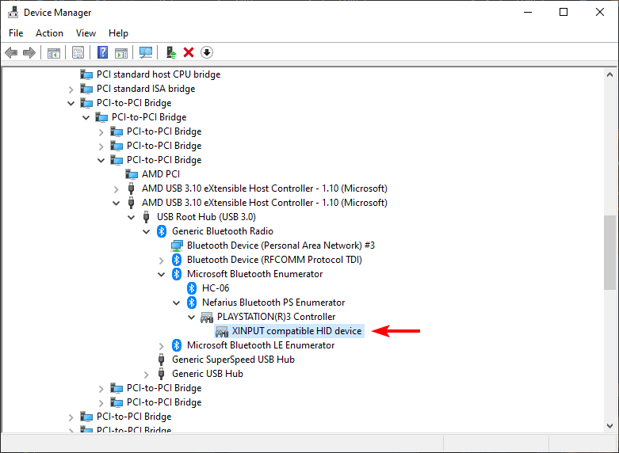
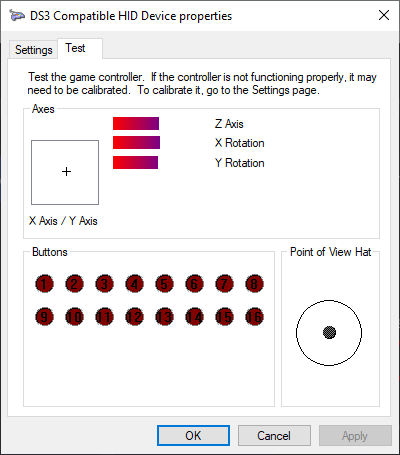
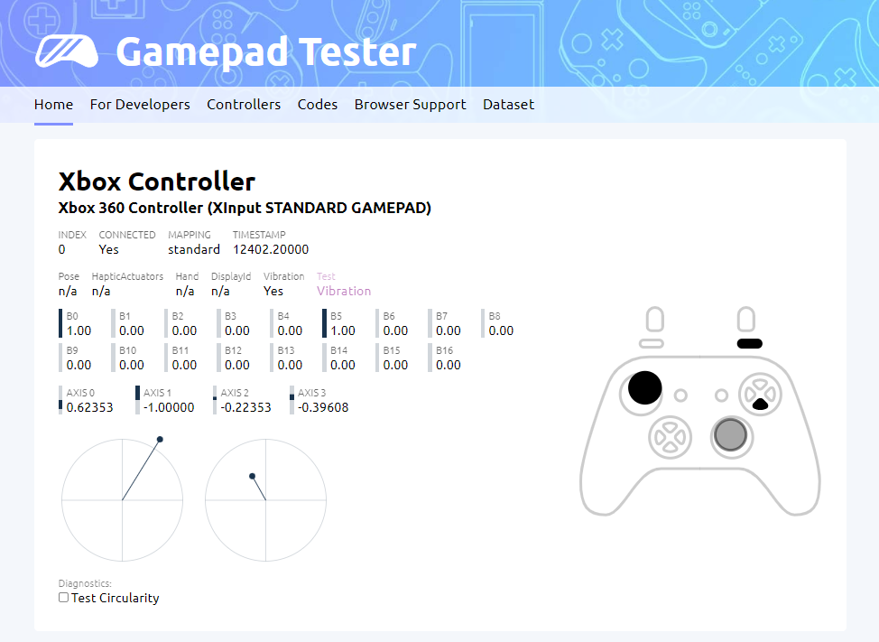

# XInput Mode Explained

DsHidMini ships with "XInput Mode" by default, this article explains what that actually means and what to expect when using DsHidMini with modern games instead of emulators. Thoroughly make yourself familiar with this topic, as it avoids confusion and false bug reports about issues that are not within the powers of the driver to change.

!!! tip "Click on images to enlarge"
    You can click/tap on each image and it will open in full resolution and become easier to read ❤️

!!! note "Why is this required, shouldn't it just be plug and play?!"
    DsHidMini was never intended for use with modern games to begin with, the main goal was to support (PlayStation) emulators first and foremost. I gave you modern game support nonetheless because that's just how awesome I am 😇 Unfortunately most modern game engines are less awesome under the hood in regards to controller handling. If they would *actually* use [XInput](https://docs.microsoft.com/en-us/windows/win32/xinput/getting-started-with-xinput) as it was intended, you'd be in the clear and wouldn't read these lines. Most engines are enumerating [DirectInput and XInput](https://docs.microsoft.com/en-us/windows/win32/xinput/xinput-and-directinput) together in a more or less (mostly less) successful way. This can lead to detection and layout issues with DsHidMini. Worry not though, read on to help yourself play your favorite game nonetheless ✨

## Double-check you're running in the correct Mode

This may seem obvious but is amongst the most common errors. In `DSHMC` triple-check **on wired and wireless** that you're actually in XInput Mode as seen below. If you recently changed it and it appears like nothing happened **unplug/disconnect and reconnect the controller** for the settings to become active!

{: .glightbox }

## Verify Mode in Device Manager

Fire up Device Manager, change the `View` to `Devices by connection` to make discovery easier and drill down into the node `Nefarius HID Devices`. Here you need to find your controller(s) and an additional `XINPUT compatible HID device` like so:

{: .glightbox }

{: .glightbox }

This is essential, if you don't see the highlighted device, the mode will not work. Check the installation guide again, you might have missed a step 👀

## Check controller functionality with test tools

### Check controller in `joy.cpl`

Press the key combination ++win+r++ and enter `joy.cpl` to bring up the integrated Joystick test and open your device (name might differ on your end, it doesn't matter):

{: .glightbox }

Verify that the **layout** displayed here matches the one you see:

{: .glightbox }

If it differs, you're in the wrong mode or something else is haunted 👻

### Check controller in `SCPUser.exe`

You can download SCPUser [from here](https://github.com/nefarius/ScpToolkit/raw/master/SCPUser.exe). It's a very basic and simple XInput detection and test tool. Your controller(s) should show up like so:

{: .glightbox }

### Check controller in Web Browser

You can also verify the controllers functionality via the [Gamepad Tester Website](https://gamepad-tester.com/). You may need to wiggle with the controls a bit before it shows up like so:

{: .glightbox }

## Setting up Steam

This mode will work best with games launched through Steam after you configured controller support like outlined here. Open your Steam Settings:

{: .glightbox }

Go to `Controller` / `GENERAL CONTROLLER SETTINGS`:

{: .glightbox }

Enable *at least* Xbox Configuration Support **and** Generic Gamepad Configuration Support:

{: .glightbox }

Now after you connected your controller, it should get detected by Steam as an Xbox One Controller like shown below:

{: .glightbox }

### Configure your Steam Games

Now go into your games `Properties...`:

{: .glightbox }

In the upcoming dialog go to `CONTROLLER` and set the override to `Enable Steam Input`:

{: .glightbox }

Once the game is launched, you should see the gamepad being detected in the overlay:

{: .glightbox }

Here's an example of the controller working like an Xbox Controller in a game with no native support for the DualShock 3 (Road Redemption):

{: .glightbox }
