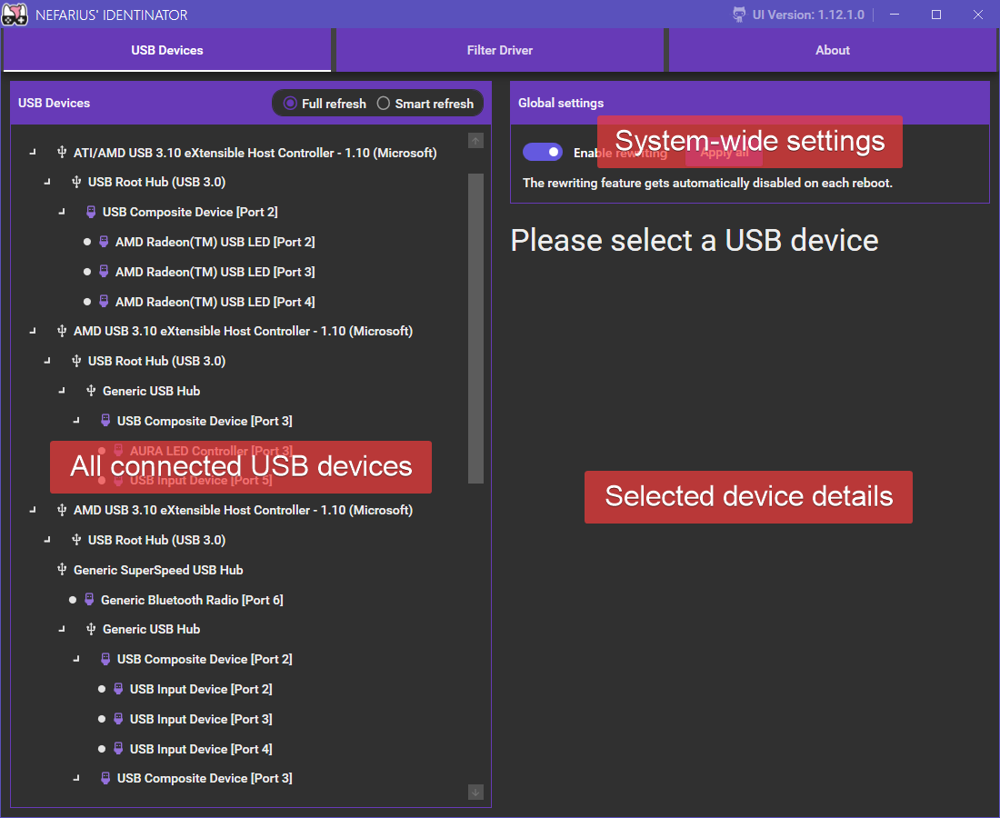

# About Nefarius' Identinator

 

!!! danger highlight "This is advanced software that won't hold your hand"
    The core feature of this software is intentionally powerful and alters essential components of how the Windows PnP subsystem detects devices and loads drivers for them. You can definitely screw up your system and/or devices if you don't know what you're doing. This is entirely YOUR responsibility, you have been warned.

The Identinator allows the user to alter (rewrite, masquerade) [Device ID](https://docs.microsoft.com/en-us/windows-hardware/drivers/install/device-ids), [Hardware ID](https://docs.microsoft.com/en-us/windows-hardware/drivers/install/hardware-ids) and [Compatible ID](https://docs.microsoft.com/en-us/windows-hardware/drivers/install/compatible-ids) properties of any USB device (Bluetooth support in the works) on a Microsoft Windows system. The solution consist of a bus filter driver (`nssidswap.sys`) and .NET UI tool to configure said driver. The changes can be applied during runtime and are instantaneous (within a few milliseconds) which can be used to "on-the-fly" swap out the function driver for e.g. HID devices.

## UI overview

### "USB Devices" tab

The primary view of the tool. Hosts the list of host controllers, hubs and connected devices. Upon device selection, the details panel gets populated and rewrite settings can be examined.

{: .glightbox } 

Each device may have additional status indicators next to their name:

- An **orange cog**: rewrite settings exist for this device
- A **red circled checkmark**: the device is currently rewritten

{: .glightbox } 

{: .glightbox } 

!!! important "Rewriting for all devices gets disabled on each reboot"
    As a safety mechanism the global rewriting switch gets **turned off automatically on each reboot**. This is by design and ensures that the system is in its original state on a fresh boot, should something catastrophic happen while rewrite is active (loss of mouse and keyboard, BSOD due to incompatible driver etc.)!

### "Filter Driver" tab

Driver version and less important settings an be reviewed here. The filter driver can be (re-)installed or uninstalled from here.

{: .glightbox } 

### "About" tab

This tab lists copyright and license information.

## Rewrite Example

Let's take the **Sony DualShock 4 Rev2** for example; by default it is represented by a composite device. This branches off into two child devices: the "USB Input Device" which represents the HID interface which in turn gets presented as "HID-compliant game controller" and a multimedia device (named "Wireless Controller") which in turn exposes a microphone and speaker device:

{: .glightbox } 

Examining the "USB Input Device" we can look at the default Hardware and Compatible IDs which get built by the Windows driver stack based on information extracted from the USB Device Descriptor:

{: .glightbox } 

{: .glightbox } 

After applying rewrite settings, the changes can be observed:

{: .glightbox } 

!!! note "The second Wireless Controller shown..."
    ...is a Sony DualShock 4 **Rev1** that was also connected and rewritten, it is completely independent from the Rev2.

{: .glightbox } 

{: .glightbox } 

Due to the compatible IDs the stock WinUSB drivers got loaded, so the device can be directly accessed with whatever software the tinkerer sees fit. If we'd used some well-known Vendor and Product IDs a potentially incompatible driver could load onto the device and react in unforeseen ways. Using WinUSB is generally "safe" as it's a generic USB driver that ships with the operating system.
